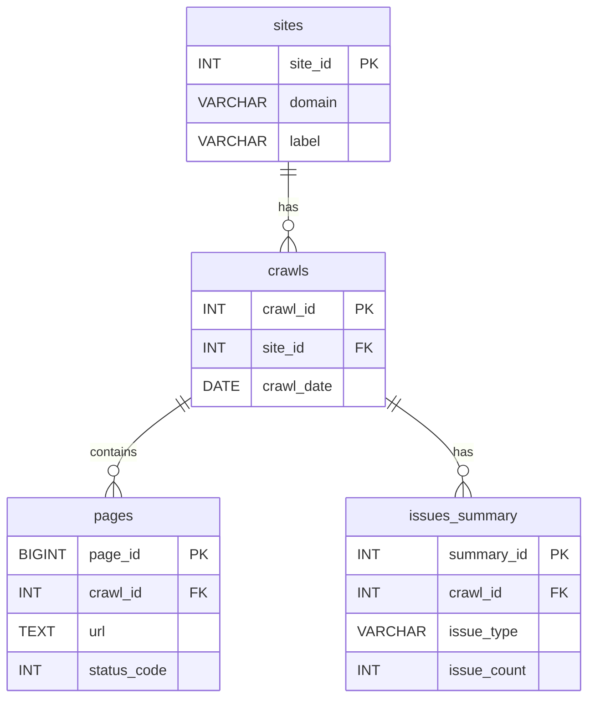

# SEO Audit Pipeline - Database Schema

This document details the PostgreSQL database schema used in the SEO Audit Pipeline. The schema is designed to store technical SEO data in a structured and efficient manner, enabling historical analysis and fast reporting.

## Schema Overview

The database consists of six primary tables:

-   `sites`: Stores the list of websites being monitored.
-   `crawls`: Contains metadata for each individual crawl execution.
-   `pages`: The largest table, storing detailed data for every URL found in a crawl.
-   `issues_summary`: An aggregated table for high-level issue counts, used for fast dashboard loading.
-   `issues_detail`: An optional, more granular table for storing specific details about each issue found.
-   `etl_logs`: A log of all ETL process activities, crucial for monitoring and debugging.

## Table Definitions

### `sites`

This table holds a record for each website in your portfolio.

| Column     | Type          | Description                                                  |
| :--------- | :------------ | :----------------------------------------------------------- |
| `site_id`  | `SERIAL`      | **Primary Key**. Unique identifier for each site.            |
| `domain`   | `VARCHAR(255)`| The domain name of the site (e.g., `example.com`). Must be unique. |
| `label`    | `VARCHAR(255)`| A human-friendly name for the site.                          |
| `status`   | `VARCHAR(50)` | The current status of the site (`active`, `inactive`, `archived`). |
| `created_at`| `TIMESTAMP`   | Timestamp of when the site was first added.                  |
| `updated_at`| `TIMESTAMP`   | Timestamp of the last update to the record.                  |

**Indexes**:
-   `idx_sites_domain`: Speeds up lookups by domain name.
-   `idx_sites_status`: Speeds up filtering for active sites.

### `crawls`

This table stores metadata for each execution of the Screaming Frog crawler for a given site.

| Column                 | Type        | Description                                                  |
| :--------------------- | :---------- | :----------------------------------------------------------- |
| `crawl_id`             | `SERIAL`    | **Primary Key**. Unique identifier for each crawl.           |
| `site_id`              | `INTEGER`   | **Foreign Key** to `sites.site_id`.                          |
| `crawl_date`           | `DATE`      | The date the crawl was performed.                            |
| `crawl_started_at`     | `TIMESTAMP` | Timestamp of when the crawl process began.                   |
| `crawl_completed_at`   | `TIMESTAMP` | Timestamp of when the crawl process finished.                |
| `total_pages`          | `INTEGER`   | The total number of pages found in the crawl.                |
| `crawl_status`         | `VARCHAR(50)`| The status of the crawl (`completed`, `failed`, etc.).       |
| `error_message`        | `TEXT`      | Stores any error message if the crawl failed.                |

**Indexes**:
-   `idx_crawls_site_id`: For quickly finding all crawls for a specific site.
-   `idx_crawls_date`: For time-based analysis.

### `pages`

This is the main data table, containing a row for every single URL found during a crawl.

| Column                  | Type        | Description                                                  |
| :---------------------- | :---------- | :----------------------------------------------------------- |
| `page_id`               | `BIGSERIAL` | **Primary Key**. Unique identifier for each page record.     |
| `crawl_id`              | `INTEGER`   | **Foreign Key** to `crawls.crawl_id`.                        |
| `url`                   | `TEXT`      | The full URL of the page.                                    |
| `status_code`           | `INTEGER`   | The HTTP status code returned by the server (e.g., 200, 404). |
| `indexability`          | `VARCHAR(50)`| The indexability state of the page (e.g., `Indexable`).      |
| `title`                 | `TEXT`      | The contents of the page's `<title>` tag.                    |
| `meta_description`      | `TEXT`      | The contents of the page's meta description tag.             |
| `h1`                    | `TEXT`      | The content of the first `<h1>` tag on the page.             |
| `word_count`            | `INTEGER`   | The total number of words on the page.                       |
| `response_time_ms`      | `INTEGER`   | The server response time in milliseconds.                    |
| `canonical_link`        | `TEXT`      | The canonical URL specified for the page.                    |

**Indexes**:
-   `idx_pages_crawl_id`: The most important index, used to scope all page queries to a specific crawl.
-   `idx_pages_url`: For finding specific pages across crawls.
-   `idx_pages_status_code`: For quickly finding pages with specific HTTP statuses (e.g., all 404s).

### `issues_summary`

This table stores pre-aggregated counts of issues for each crawl. This is a performance optimization to make high-level dashboards load very quickly without having to scan the entire `pages` table.

| Column         | Type          | Description                                                  |
| :------------- | :------------ | :----------------------------------------------------------- |
| `summary_id`   | `SERIAL`      | **Primary Key**.                                             |
| `crawl_id`     | `INTEGER`     | **Foreign Key** to `crawls.crawl_id`.                        |
| `issue_type`   | `VARCHAR(100)`| The name of the issue (e.g., `Missing Meta Description`).    |
| `issue_category`| `VARCHAR(50)` | The severity of the issue (`error`, `warning`, `notice`).    |
| `issue_count`  | `INTEGER`     | The number of pages affected by this issue in this crawl.    |

### `etl_logs`

This table provides a complete audit trail of the ETL process, which is invaluable for debugging.

| Column      | Type        | Description                                                  |
| :---------- | :---------- | :----------------------------------------------------------- |
| `log_id`    | `SERIAL`    | **Primary Key**.                                             |
| `crawl_id`  | `INTEGER`   | The crawl being processed when the log event occurred.       |
| `site_id`   | `INTEGER`   | The site being processed.                                    |
| `log_level` | `VARCHAR(20)`| The severity of the log (`INFO`, `WARNING`, `ERROR`).        |
| `message`   | `TEXT`      | The detailed log message.                                    |
| `file_path` | `TEXT`      | The path to the CSV file being processed, if applicable.     |
| `created_at`| `TIMESTAMP` | Timestamp of the log event.                                  |

## Entity-Relationship Diagram (ERD)

A simplified view of the relationships between the core tables.

